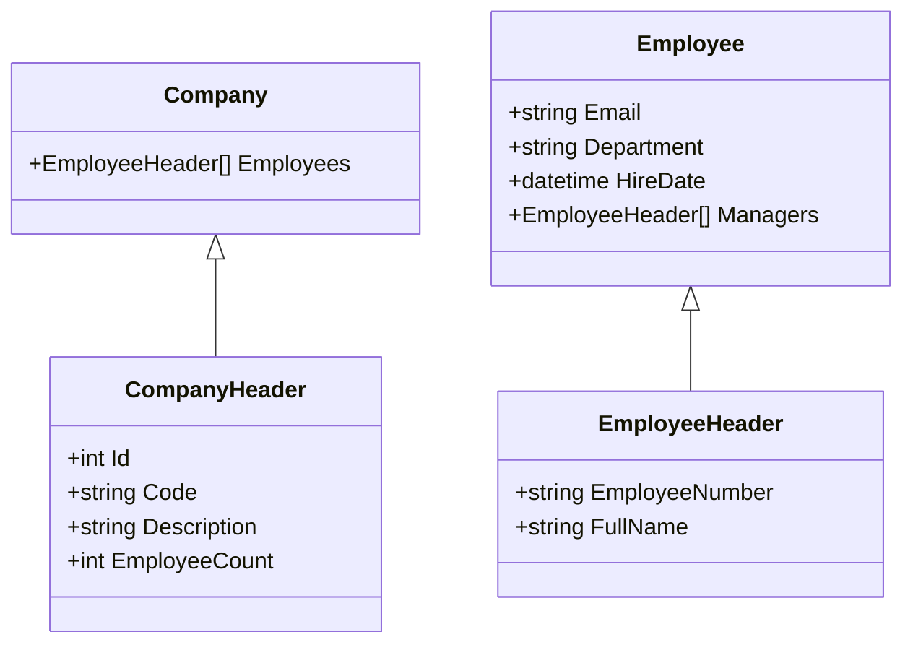
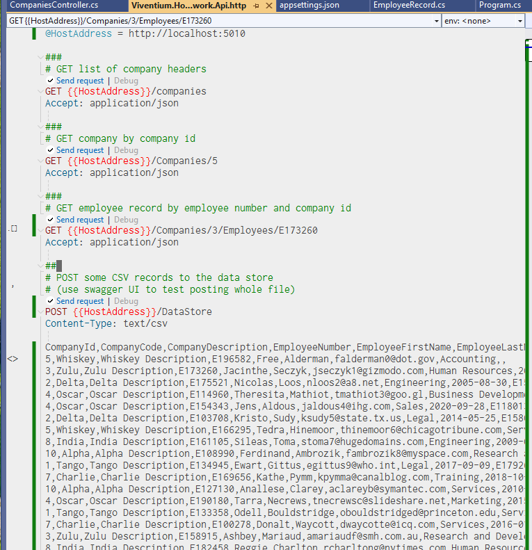

## Viventium Homework Assignment

### Overview

Assignment was to create an api in c# using EF Core
and use it to implement a set of requirements. The 
requirements were that you could post CSV data to the 
api and have that data replace any existing dataset
to be used for the other GET calls.

The GET calls were to return a list of companies, a 
single company with it's employees, and a single 
employee. It is important to note that there are new
models for all of the returned data.

### CSV import 

The import of CSV records was done using CSVHelper which
is a time saver and is flexible in the mapping of records
to columns. The data is inserted into a single table so 
that the deletion and insertion are fairly quick.

Note that the deletion could have been done better but
I chose to use an in memory database for the EF context
and one of the side effects of that decision is the lack
of support for a method to delete all the records at once.

### data
The incoming data is in the flattened form of employee records
with the company values included in each row. Per the instructions
sheet, there are some validations that can be counted on for the
structure of the data. For example each employee id is unique with 
in a company.  

### GET calls
The GET calls are done using LINQ queries against the single 
DBSet of the original csv records. The class structure of the returned 
values follows this structure:

### Testing

The easiest way to run the app is to open the solution
in VS2022 and utilize the .http file shown below, in 
order to make the 4 calls.

Remember to make the bottom POST call first, and then
with data in the context you can make the other 3 calls.

